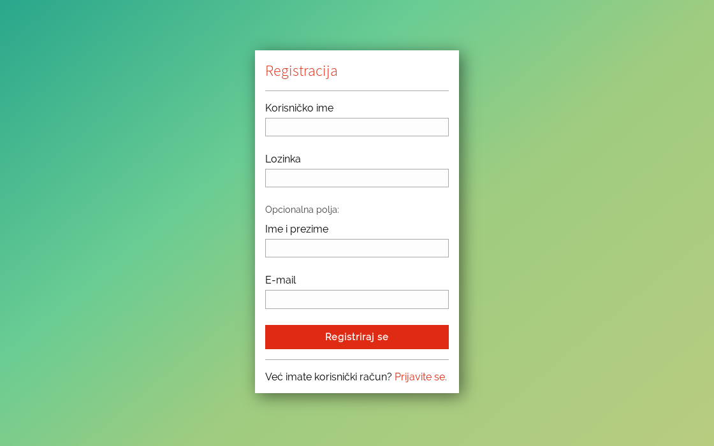
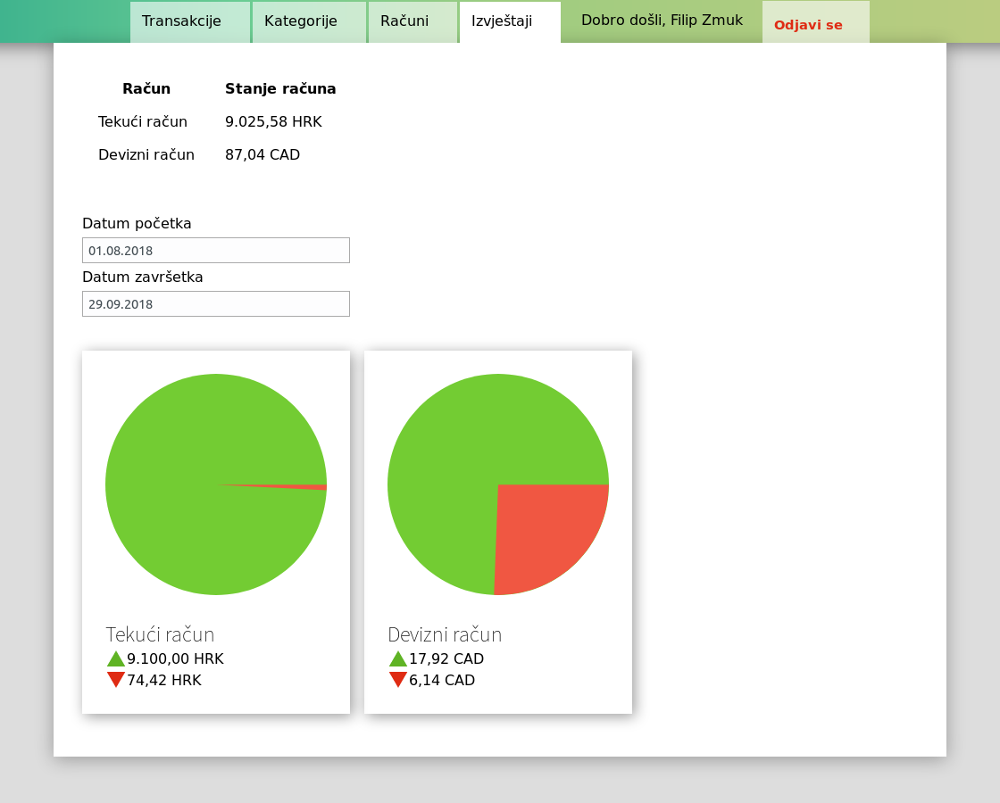
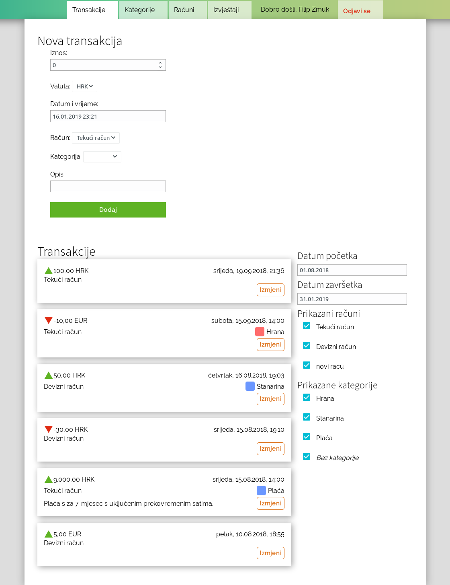
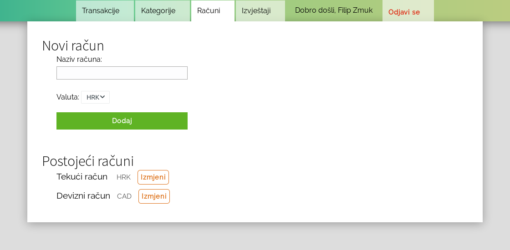
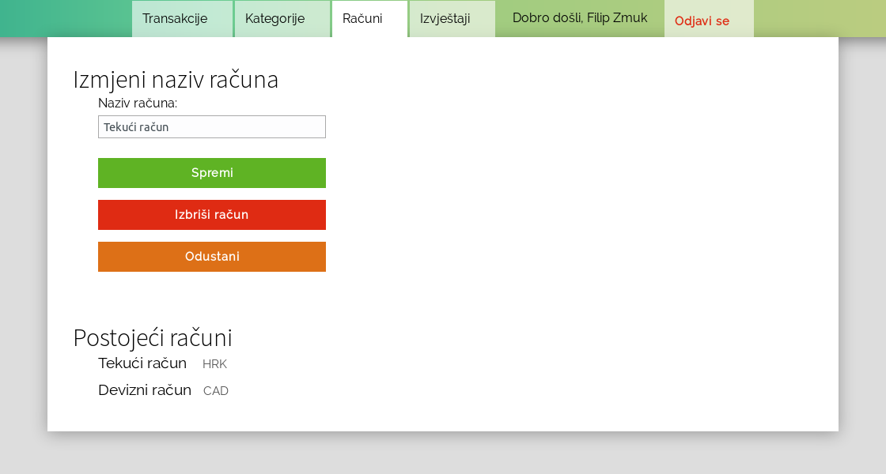

# V-Alt

V-Alt is an app I made for my bachelor thesis (that's why it is in Croatian). It was done in short and very stressful time. It was also my first real React app. I tried different things so I learned a lot but some solutions aren't ideal. 

It was done before GitHub had free private repositories so it was done using GitLab on two repositories (client and server) which are now directories in this one. 

## Technologies used

### Front-end
* React
* Redux
* React-Router
* Designed from scratch without CSS frameworks

### Back-end
* Node.JS
* TypeScript
* PostgreSQL
* TypeORM
* Express

Application screenshots

